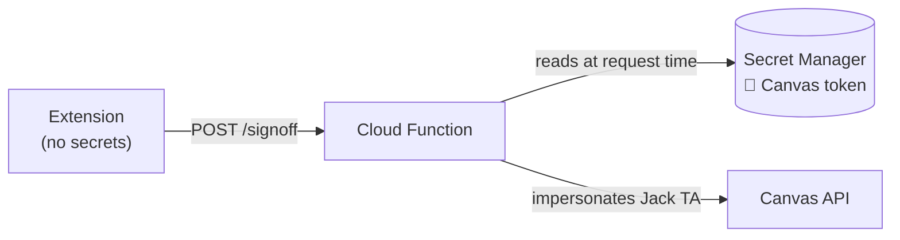

# Addendum — 2026-05-11

Recorded after the main meeting. Walkthrough of how Jack will get a Canvas API token and how the extension will use it.

## Adding Jack to the Canvas course

- Canvas user search returned two similar handles — `jackjohn684` (Jack's actual account) and a near-duplicate (something like "jack@safelearning"). They look almost identical; pick carefully when adding people.
- Jack has been added to the course on Canvas.

## Generating a Canvas API access token

1. Click your **profile picture** (top-left of Canvas).
2. Click **Settings**.
3. Scroll to **Approved Integrations** (a.k.a. the Integrations section).
4. Click **New Access Token**.
5. Copy the token immediately — Canvas only shows it once.

## What the token actually grants

A Canvas access token is **full impersonation** of the user who minted it. Whatever the user can do in Canvas, the token can do:

- Edit grades on any course where the user is a TA or instructor.
- Post/edit submissions on their behalf.
- Read course rosters, assignments, submissions.

For the extension: **Jack's TA-level token** is what will be used in production to auto-write topic-exam pass-offs to Canvas grades. A TA token only has power inside courses where Jack is a TA, which scopes the blast radius nicely — if leaked, an attacker can only mess with CS 393, not every course the instructor teaches. The same token works for local dev and production.

## Why this changes the architecture (re-emphasis)

This is exactly why the architecture from [architecture.md](architecture.md) keeps the token in **GCP Secret Manager**, not in the extension:

- The extension never sees the token.
- The Cloud Function reads it from Secret Manager at request time.
- The extension just calls `POST /signoff` and the function does the Canvas call.

## Security rules for the token

- Treat the token like a password. If it leaks, anyone can change grades in CS 393 (any course where Jack is a TA).
- **Only** store in Google Secret Manager. Never commit it to the repo. Never put it in `chrome.storage.*`. Never log it (not even truncated).
- For local dev, the same token can be used — kept in a gitignored `.env` and matching the Secret Manager value.
- Rotate (regenerate) at least once a semester, or immediately if compromise is suspected. Old tokens can be revoked from the same Integrations page.

## Action items added today

- [ ] Jack: generate his TA-level Canvas token; store it in Secret Manager under `projects/cs393-496021/secrets/canvas-api-token` (used in both production and local dev).
- [ ] Backend code: read the secret via the Google Cloud client library, never from environment variables in deployed Functions.
