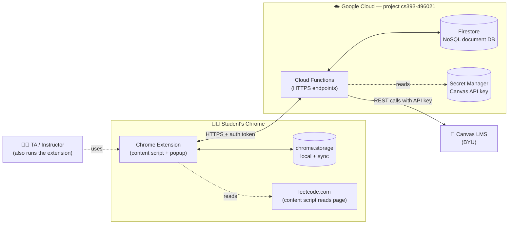
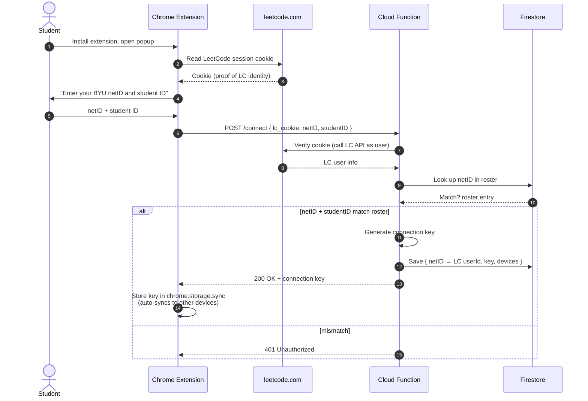
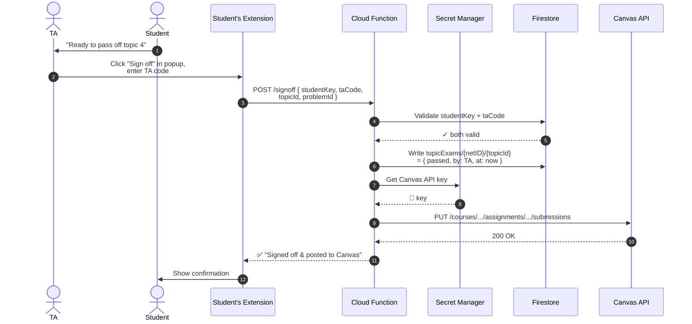
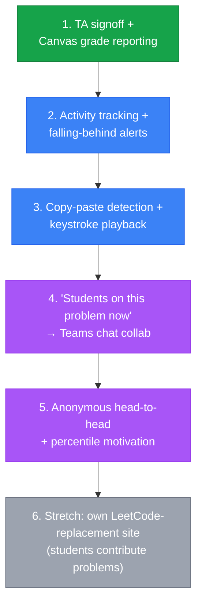
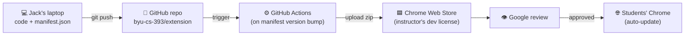

# Architecture overview — CS 393 extension

Visual companion to the [2026-05-11 meeting notes](notes-5-11-2026.md). Diagrams below render natively on GitHub and in VS Code (with the Markdown Preview Mermaid Support extension).

---

## 1. System at a glance

Where each piece lives and who talks to whom.



**Key idea:** the Canvas API key never lives in the extension. The extension talks to a Cloud Function; the function pulls the key from Secret Manager and makes the Canvas call on the student's behalf.

---

## 2. First-time connection (auth flow)

How a student gets verified the first time they install the extension.



**Why this works:** chrome.storage.sync (~1 MB) automatically replicates the connection key across every Chrome instance the student is signed into — so they install on laptop + desktop and don't re-auth.

---

## 3. TA signs off a topic exam → Canvas grade posted

The flagship workflow. Highest priority feature from the meeting.



---

## 4. Data model (Firestore collections)

Firestore is document-based — think "folders of JSON files." Each box below is a collection; arrows are references.

```mermaid
erDiagram
    STUDENT ||--o{ ACTIVITY : "logs"
    STUDENT ||--o{ TOPIC_EXAM : "passes"
    STUDENT ||--o{ KEYSTROKE_RECORDING : "produces"
    STUDENT }o--o| MOCK_INTERVIEW : "participates"
    TA ||--o{ TOPIC_EXAM : "signs off"
    CLASS ||--|{ STUDENT : "enrolls"
    CLASS ||--o{ COMPETITION : "weekly"

    STUDENT {
        string netID PK
        string studentID
        string leetcodeUserId
        string connectionKey
        array  devices
        string privacyOptIns
    }

    ACTIVITY {
        string netID FK
        string problemSlug
        timestamp at
        string event "view_open_submit_pass"
        int    durationMs
    }

    TOPIC_EXAM {
        string netID FK
        string topicId
        timestamp passedAt
        string signedOffBy "TA netID"
        string kind "performance_or_articulation"
    }

    KEYSTROKE_RECORDING {
        string netID FK
        string problemSlug
        array  keystrokes "ts plus key"
        bool   pastedFlag
    }

    MOCK_INTERVIEW {
        string sessionID PK
        array  participants
        timestamp at
    }

    COMPETITION {
        string weekISO PK
        map    scores "netID -> points"
    }

    TA {
        string netID PK
        string codeHash
        bool   active
    }
```

**Privacy rule from the meeting:** anything stored about a student must be visible/replayable to that student. The `KEYSTROKE_RECORDING` collection in particular is what enables the "play back how you typed your solution" feature.

---

## 5. Feature priorities (build order)

What to ship first vs. later. From the meeting's priority discussion.



Green = MVP. Blue = next. Purple = motivation/social layer. Grey = stretch goal for a future semester.

---

## 6. Deployment pipeline

How code gets from Jack's machine to a real installed extension.



For local development: load the unpacked extension folder directly into Chrome via `chrome://extensions` → "Load unpacked." No build step needed initially.

---

## Glossary (quick reference)

| Term | What it is |
|---|---|
| **Chrome extension** | A folder with a `manifest.json` + JS/HTML/CSS. Runs in the user's Chrome. |
| **Content script** | Extension JS injected into a real webpage (e.g., leetcode.com) so it can read/modify the DOM. |
| **chrome.storage.sync** | ~1 MB key-value store that auto-replicates across the user's Chrome installs. |
| **chrome.storage.local** | ~20 MB key-value store, single device. |
| **Firestore** | Google's hosted NoSQL document DB. Stores JSON-shaped documents in collections. |
| **Cloud Function** | A small piece of code that runs on demand when an HTTPS endpoint is hit. Like AWS Lambda. No always-on server. |
| **Secret Manager** | A safe place to store API keys/credentials. Cloud Functions can read them; the extension never sees them. |
| **ADC (Application Default Credentials)** | How `gcloud`-authenticated tools authenticate to Google APIs from a dev machine. |
