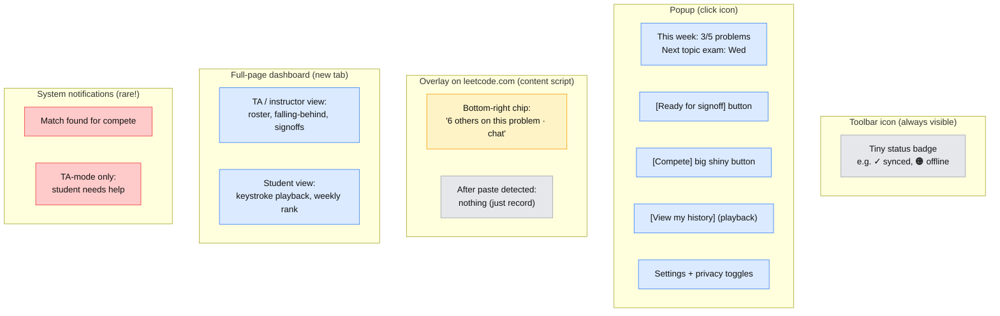

# UX brainstorm — 2026-05-11

Captured from an in-person conversation with Jack about UX for the Chrome extension. Includes the open questions raised, my proposed answers with confidence levels, and questions back to the team.

---

## What the team raised

- Two UX phases to design for separately:
  1. **First-day-of-class setup** — heavyweight, one-time onboarding (netID, student ID, install, etc.).
  2. **Ongoing daily use** — lives in the background. When should it surface vs. stay silent?
- Specific surface questions:
  - How do you expose the **compete / head-to-head** option without making it feel like a video game when they're trying to study?
  - How do you surface "**6 others are working on this problem right now — start a chat?**" — big popup? Tiny widget? Nothing at all?
  - **Copy-paste callouts**: do we ever say "you've been pasting solutions, this is wasting your time"? Or stay silent and let them discover it themselves?
- **Tension:** how many gadgets can fit before the extension looks busy?
  - Reference point: "Interview Ready" feels like it has too many buttons.
  - Target users are CS juniors/seniors — they can handle a "cockpit" style if it's worth it.
  - Counterpoint: a course-context extension can be opinionated and surface **zero** buttons by default, because we know what the user is supposed to be doing.

---

## Proposed UX direction (my draft)

### Guiding principle: "Silent by default, available on demand"

The extension's job is to remove friction from things students already do (track problems, get grades to Canvas, find a study partner), not to add new chores. So default state: invisible / status-only. Surface things only when the student has stopped coding and is about to lose momentum or has explicitly opened the popup.

### Surface map

Each Chrome extension has a few places it can put UI. Here's where I'd put each feature.



**Legend:** grey = silent/passive, blue = surfaces only when user opens it, yellow = appears contextually on the LeetCode page, red = interrupts the user (use sparingly).

### Per-feature recommendations

| Feature | Where | Confidence | Rationale |
|---|---|---|---|
| Canvas grade auto-sync | Toolbar badge only (✓/✗) | **95%** | Should be invisible. Badge gives reassurance without nagging. |
| TA signs off topic exam | Popup button + TA code entry | **90%** | TA flow is rare, deserves real estate when active. |
| Falling-behind alerts | TA/instructor dashboard ONLY | **95%** | Instructor said outreach should feel human — *humans* see the alert, not students. |
| Copy-paste detection | **Silent record** + visible later in self-history | **80%** | Instructor explicitly said live nagging doesn't help. Self-discovery via keystroke playback is the move. |
| "6 others on this problem" | Bottom-right floating chip on LeetCode | **70%** | Risk: distraction during deep work. Mitigate: tiny, dismissible, only appears after 5+ min on the problem. |
| Compete / head-to-head | Opt-in toggle in popup, then big "Find match" button | **90%** | Don't surface mid-session. They opt into a "compete mode" deliberately. |
| Mock interview pairing | Prominent popup tile + email/Teams handoff | **75%** | Instructor said pair-mock-interviews predict success — worth more weight in the UI than "compete." |
| Percentile / leaderboard | Dashboard (new tab), not popup | **85%** | Curious students can dig in; not everyone needs to see it daily. |
| Activity tracking | Zero UI — just data collection | **95%** | The point is metadata, not display. |
| Privacy / what we store | Always 1 click away from popup → full transparency page | **100%** | BYU policy requires it and it's the right thing. |

### Popup mockup (default state, student)

```
┌─────────────────────────────────────┐
│  CS 393 Buddy             ✓ synced  │
├─────────────────────────────────────┤
│                                     │
│  This week                          │
│    ████████░░  3/5 problems         │
│    Next topic exam: Wed 2pm         │
│                                     │
│  Currently on: Two Sum II           │
│    ⏱  12 min · 0 pastes             │
│                                     │
│  [ Ready for signoff ]              │
│                                     │
│  ─────────────────────────────      │
│  ▸ Compete with someone             │
│  ▸ Find a study partner             │
│  ▸ My history (playback)            │
│  ─────────────────────────────      │
│  ⚙ Settings · 🔒 Your data          │
└─────────────────────────────────────┘
```

Three things at the top, three collapsed links at the bottom. Cockpit when needed (expand a section), clean otherwise.

### Popup mockup (TA mode)

```
┌─────────────────────────────────────┐
│  CS 393 Buddy (TA: Jack)            │
├─────────────────────────────────────┤
│  Active student: Andrew R.          │
│  Problem: LRU Cache                 │
│  Session: 23 min · 2 pastes ⚠       │
│                                     │
│  [ Sign off — Performance exam ]    │
│  [ Sign off — Articulation exam ]   │
│  [ View keystroke replay ]          │
│                                     │
│  ─────────────────────────────      │
│  Needs attention this week (3)      │
│    • Bryce W. — 0 problems          │
│    • Maria C. — pace down 60%       │
│    • Andrew R. — copy-paste flags   │
└─────────────────────────────────────┘
```

---

## Questions back to the team

Before locking the layout, I'd want to hear:

1. **Who initiates topic-exam signoff** — the student says "I'm ready" and the TA confirms, or the TA decides when it's time? (Affects whether the "Ready for signoff" button lives in the student popup or the TA popup.)
2. **How aggressive should the "6 others on this problem" prompt be?** A chip in the corner can be ignored; a modal interrupts. My instinct says chip — confirm?
3. **Mock-interview pairing weight.** Instructor said pair mock interviews are the single strongest success signal. Do we want a *bigger* prompt for that than for "compete"? Right now my mockup gives them equal weight.
4. **Per-feature opt-out, or one master opt-in?** BYU privacy guidance is unclear here — does the instructor want "all or nothing," or granular toggles per feature?
5. **TA dashboard format.** Is the TA dashboard a tab inside the popup, or a full new-tab dashboard? Full tab gives more room but is one more thing to discover.
6. **Copy-paste — truly silent, or one gentle nudge?** I'm proposing silent, but the instructor's "you're cheating yourself" framing might support a single, dismissible nudge the first time it's detected per problem. Where do we land?

---

## My confidence in the overall direction

**~80%.** I'm confident in:

- Silent-by-default Canvas sync (95%)
- TA-side vs student-side split for alerts (95%)
- Surfacing compete/collaborate as opt-in rather than push (90%)

I'm less sure about:

- Whether the LeetCode-page overlay chip is the right way to surface collaboration, or whether it'll annoy people enough that they disable the extension (70%).
- Whether students will actually open the popup often enough to discover features that live there (60%). Might need a one-time tour, or smarter toolbar-badge cues that say "tap me for something useful."

Happy to iterate on any of the above. The mockups are intentionally rough — once we agree on the surface map and the per-feature decisions, the visual design is straightforward.
