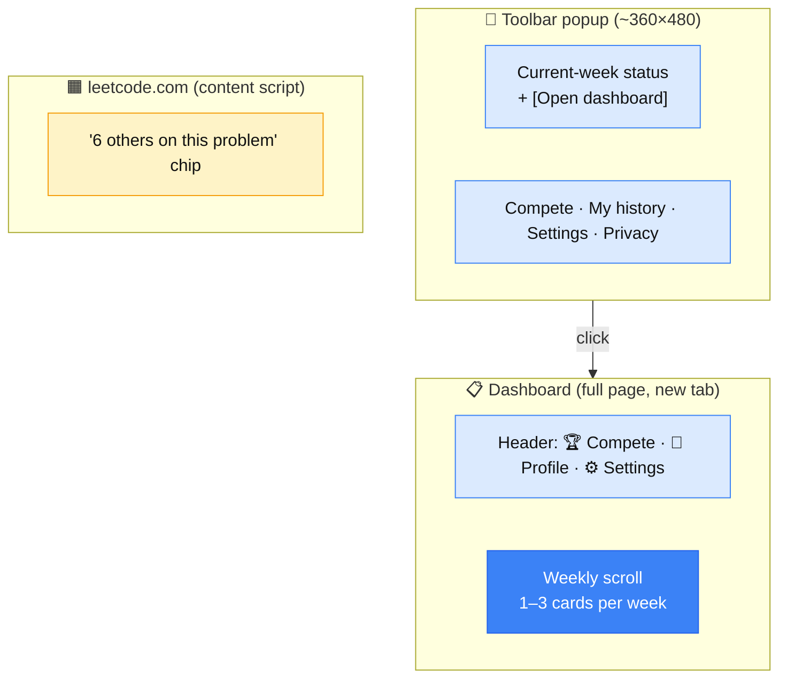

# UX direction — locked 2026-05-12

Follow-up to [ux-5-11-2026.md](ux-5-11-2026.md). After a design session iterating on ASCII mockups, the student-facing UX is now locked. Several of the open questions from the original brainstorm are resolved here; the rest are listed at the bottom.

The high-level inspiration is **Duolingo × Canvas**: Duolingo for the single-button-with-progress motivation pattern, Canvas for the weekly-list mental model students already use. The goal is to reduce decision paralysis — when a student opens the extension, the next thing to do is one click away.

---

## Architecture

Three UI surfaces, each with a clear role:



- **Dashboard** is the primary UI. It's a Canvas-style infinite scroll of weekly cards. Lives at `chrome-extension://.../dashboard.html` and opens in a new tab.
- **Toolbar popup** is a quick-status snapshot + entry point to the dashboard. Sized for a Chrome popup (~360×480) — too small for the full scroll, so it doesn't try.
- **Out-of-scroll surfaces:** Compete, Profile, Settings/Privacy live in the *dashboard header*, not in weekly cards. Keystroke playback ("My history") is reached from the toolbar popup. Falling-behind and copy-paste alerts go to TAs via email/Teams — not in the student UI at all (preserves the "human touch" mandate from the meeting). The "6 others on this problem" chip lives on leetcode.com itself.

---

## Dashboard mockup

Week 6 below shows the maximum case — all three card types stacked. Most weeks will have fewer.

```
╔════════════════════════════════════════════════════════════╗
║  CS 393 Buddy · Spring 2026             ✓ synced           ║
║                                  [🏆 Compete]  [👤]  [⚙]  ║
╠════════════════════════════════════════════════════════════╣
║                                                            ║
║  ━━━━━ Week 6 · CURRENT ━━━━━━━━━━━━━━━ May 11 – 17 ━━━━  ║
║                                                            ║
║   ┌─ Recommended problems ───────────────────────────┐    ║
║   │  ▓▓▓░░░░░░░░░  3 / 12                            │    ║
║   │  Currently on: Two Sum II                        │    ║
║   │  [ Next problem → ]                  [ Show all ▼]│    ║
║   └──────────────────────────────────────────────────┘    ║
║                                                            ║
║   ┌─ Choice problems · 1 / 3 ────────────────────────┐    ║
║   │  Solve any 3 problems this week — your pick      │    ║
║   │  ✓ Climbing Stairs                               │    ║
║   │  [ Pick problem ]    [ 🎲 Surprise me ]          │    ║
║   └──────────────────────────────────────────────────┘    ║
║                                                            ║
║   ┌─ Topic Exam · Hash Maps ─────────────────────────┐    ║
║   │  Solve a problem with a TA · 30 min              │    ║
║   │  [ Request signoff ]                             │    ║
║   └──────────────────────────────────────────────────┘    ║
║                                                            ║
║  ━━━━━ Week 5 ━━━━━━━━━━━━━━━━━━━━━━━━ May 4 – 10 ━━━━━  ║
║                                                            ║
║   ┌─ Recommended problems ───────────────────────────┐    ║
║   │  ▓▓▓▓▓▓▓▓▓▓▓▓  12 / 12  ✓                        │    ║
║   └──────────────────────────────────────────────────┘    ║
║                                                            ║
║   ┌─ Mock Interview ─────────────────────────────────┐    ║
║   │  Paired with Maria C. · 18 min                   │    ║
║   │  ✓ Completed                                     │    ║
║   └──────────────────────────────────────────────────┘    ║
║                                                            ║
║  ━━━━━ Week 4 ━━━━━━━━━━━━━━━━━━━━━━━━ Apr 27 – May 3 ━  ║
║                                                            ║
║   ┌─ Recommended problems ───────────────────────────┐    ║
║   │  ▓▓▓▓▓▓▓▓▓▓░░  10 / 12 · past due                │    ║
║   │  [ Finish late ]                                 │    ║
║   └──────────────────────────────────────────────────┘    ║
║                                                            ║
║   ┌─ Online Assessment · Arrays & Strings ───────────┐    ║
║   │  ✓ Passed (attempt 2 of 3)                       │    ║
║   └──────────────────────────────────────────────────┘    ║
║                                                            ║
║  ⋮  scroll for earlier weeks  ⋮                            ║
║                                                            ║
╚════════════════════════════════════════════════════════════╝
```

---

## Toolbar popup mockup

```
┌─────────────────────────────────────┐
│  CS 393 Buddy        ✓ synced       │
├─────────────────────────────────────┤
│                                     │
│  Week 6                             │
│  ▓▓▓░░░░░░░░░  3 / 12 problems      │
│                                     │
│  ⚠ Topic exam due Wed               │
│                                     │
│  [ Open dashboard ]                 │
│                                     │
│  ─────────────────────              │
│  ▸ Compete (find a match)           │
│  ▸ My history (playback)            │
│  ─────────────────────              │
│  ⚙ Settings  ·  🔒 Your data        │
└─────────────────────────────────────┘
```

---

## Weekly card structure

Each week has **1–3 stacked cards**. The card types are:

### 1. Recommended problems (always)

Progress bar `X / N`, a primary `Next problem →` button that opens the next unsolved problem on leetcode.com, and a `Show all ▼` expander.

**Expanded view:**

```
   ┌─ Recommended problems ───────────────────────────┐
   │  ▓▓▓░░░░░░░░░  3 / 12                            │
   │  [ Next problem → ]                  [ Hide ▲ ]  │
   ├──────────────────────────────────────────────────┤
   │  ✓  1. Two Sum                       · 12 min    │
   │  ✓  2. Valid Parentheses             · 23 min    │
   │  ✓  3. Merge Two Sorted Lists        · 18 min    │
   │  ▸  4. Two Sum II                    · 28 min ↻  │
   │     5. 3Sum                                      │
   │     6. Container With Most Water                 │
   │     7. Trapping Rain Water                       │
   │  ⚠  8. Group Anagrams                · 1h12m, 0  │
   │     9. Longest Substring Without Repeating       │
   │    10. Sliding Window Maximum                    │
   │    11. Find Median of Two Sorted Arrays          │
   │    12. Merge K Sorted Lists                      │
   └──────────────────────────────────────────────────┘
```

Legend: `✓` solved · `▸` current · `↻` in progress · `⚠` stuck (long time, no submit) · plain = untouched. Click any row to jump to that problem on LeetCode. The expandable list is meant to solve the "stuck on problem 4 for 2 hours" failure mode — students can pivot to another problem and come back.

### 2. Choice problems (sometimes)

Only present on weeks that include an "any problems of your choice" requirement. Shows progress `X / N`, the picks completed so far, and two buttons: `[Pick problem]` and `[🎲 Surprise me]`. Both pull from LeetCode's full catalog with a difficulty filter appropriate for this week; *Surprise me* additionally excludes problems already solved.

### 3. One of: Online Assessment / Mock Interview / Topic Exam (sometimes)

Same visual treatment, different verb depending on type:

| Type | Button | Behavior |
|---|---|---|
| Online Assessment | `[Start]` / `[Try again]` | Pass/fail exam with up to **3 attempts** — see below. |
| Mock Interview | `[Find a partner]` | Pairs the student with another classmate who's also looking. |
| Topic Exam | `[Request signoff]` | Pings a TA / books a 30-minute slot. The TA passes off the student through the TA-mode dashboard (not yet designed). |

#### Online Assessment — multi-attempt structure

The online assessment is a pass/fail credential, not a scored test. Students get up to three attempts; each attempt is **easier than the last** so the design is geared toward eventual success with appropriate friction.

| Attempt | Difficulty | Time limit | Help allowed |
|---|---|---|---|
| 1 | Hardest | Timed | None — solo, no external help |
| 2 | Easier | Timed | None — solo, no external help |
| 3 | Easiest | **None** | **Encouraged** — work with a TA or classmate on all of the problems |

The third attempt is functionally a guided learning session: by the time a student reaches it, the goal shifts from "prove you can" to "make sure you understand." Within each timed attempt, the same flow as before applies — the timer pauses between problems, and the next problem is hidden until the current one is submitted.

**Card states for the Online Assessment:**

```
   Not started:
   ┌─ Online Assessment · Arrays & Strings ───────────┐
   │  Pass/fail · 3 attempts · attempt 1 is timed     │
   │  [ Start attempt 1 ]                             │
   └──────────────────────────────────────────────────┘

   Failed attempt 1:
   ┌─ Online Assessment · Arrays & Strings ───────────┐
   │  Attempt 2 of 3 · easier · still timed · no help │
   │  [ Try again ]                                   │
   └──────────────────────────────────────────────────┘

   Failed attempt 2:
   ┌─ Online Assessment · Arrays & Strings ───────────┐
   │  Attempt 3 of 3 · easiest · no time limit        │
   │  Get help from a TA or classmate                 │
   │  [ Try again with help ]                         │
   └──────────────────────────────────────────────────┘

   Passed:
   ┌─ Online Assessment · Arrays & Strings ───────────┐
   │  ✓ Passed (attempt 2 of 3)                       │
   └──────────────────────────────────────────────────┘
```

---

## Decisions baked into this design

| Decision | Why |
|---|---|
| Topic-exam signoff is **student-initiated** (button lives in the student popup) | Resolves UX-doc open question #1. Student says "I'm ready"; TA confirms via TA-mode dashboard. |
| Past weeks **remain clickable for late completion** (`[Finish late]`) | The course doesn't enforce hard weekly deadlines in the UI. Falling-behind detection runs in the background regardless. |
| Future weeks are **hidden** until released (Duolingo-style) | Reduces overwhelm. Canvas-style "the whole semester is laid out" would work too — picked Duolingo on instinct. *(Worth re-checking with the instructor.)* |
| Each topic exam has a **topic name** ("Hash Maps", "Dynamic Programming") | Matches the meeting transcript and gives students context for what they're being tested on. Data model needs `topicExam.topic` per week. |
| Online assessment is **pass/fail with 3 attempts**, each easier, third one untimed and collaborative | Reflects the actual structure of the assessment as designed for the course. The third attempt is intentionally a learning experience, not a final hurdle. |
| Mock-interview partner shown **by first name + last initial** | Classmates can already see each other on Canvas — not a new disclosure. |
| Recommended button at `N/N` collapses to a checkmark row | Redoing happens via LeetCode directly, not the extension. |
| **Choice problems** card includes `[🎲 Surprise me]` for random selection | Reduces decision paralysis when students get stuck or don't know what to pick. Excludes already-solved problems. |
| **Compete** lives in the dashboard header, not as a per-week button | Treats compete as an always-available motivation layer rather than coupling it to weekly work. *(If the instructor wants it tied to specific weekly problems, this moves to a per-week button.)* |

---

## Open UX questions still to decide

- **The `⚠` "stuck" threshold value.** Working assumption: 1 hour with no submission. Want a real number based on what's actually predictive of struggling.
- **Privacy display for partner names.** Locked on "first name + last initial" tentatively, but worth confirming.
- **"Pick problem" source.** Lean: open LeetCode's full catalog with a difficulty filter for this week. Alternative: a small curated pool. The instructor's transcript leaned toward "students choose interesting problems themselves" → full catalog wins.
- **Compete entrypoint behavior.** Header button is decided, but clicking it isn't yet specced (find-a-match? leaderboard? both?).
- **What counts as "failing" an online-assessment attempt.** Not solving every problem? Below some threshold? Triggers the move to the next (easier) attempt.

## Not yet designed

These are deferred to subsequent design sessions:

- **TA-mode dashboard.** Same scroll layout, but each row shows pending signoff requests with a `[Pass off]` action. Likely also surfaces falling-behind / copy-paste alerts inline rather than only via email/Teams.
- **Compete flow.** Click → matchmaking → head-to-head → result.
- **Profile / history page.** Keystroke playback, weekly rank, badges.
- **Settings / privacy page.** Per-feature opt-outs (pending UX-doc question #4 on master vs granular).
- **Onboarding / first-connect flow.** LeetCode cookie → BYU netID → student ID → connection key stored in `chrome.storage.sync`. Sequence diagram exists in [architecture.md](architecture.md#2-first-time-connection-auth-flow); UI for it is not yet mocked.
- **leetcode.com content-script chip** for "6 others on this problem."

---

## What this resolves from the original brainstorm

Of the open questions in [ux-5-11-2026.md](ux-5-11-2026.md):

- **Q1 (who initiates signoff):** student. Resolved.
- **Q2 (how aggressive the collab prompt):** still leaning chip (decided in the 5/11 brainstorm). Not affected by this design.
- **Q3 (mock-interview weight vs compete):** mock interview gets a per-week card *when assigned*; compete lives in the header *always*. So mock interview has more presence when relevant. Partial resolution.
- **Q4 (per-feature opt-out vs master opt-in):** deferred — needs BYU privacy guidance.
- **Q5 (TA dashboard format):** decided — same scroll, different actions. Mockup pending.
- **Q6 (copy-paste — silent or nudge):** resolved 5/11 — silent for student, push alerts to TAs.
